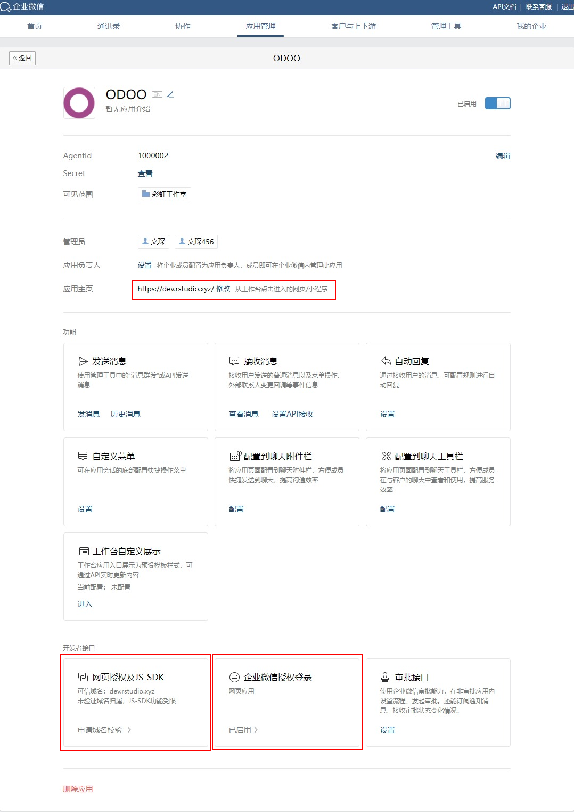

验证登陆
=================================

.. toctree::
   :maxdepth: 2

安装
---------------------------------

-----------------

设置
---------------------------------

-----------------

设置 OAuth
---------------------------------

1. 确保使用域名访问，不要使用IP地址。如下图操作

-----------------

企微后台设置
---------------------------------

1. 登陆企业微信后台，“应用管理” → “自建” 。打开 “您的自建应用”，设置红框标识的区域
   

-----------------

2. 设置 网页授权及JS-SDK
  

-----------------

3. 如何校验域名，如下图，下载校验文件

3.1 在nginx配置文件中添加如下配置
  
.. code::

   location = /WW_verify_BQqOiwS117L9unq6.txt {
      default_type text/html;
      return 200 '校验文件的文本内容';
   }

3.2 如下图，点击“完成”按钮，完成域名校验

-----------------

4. 设置扫码登陆

-----------------

登陆页面展示
---------------------------------

.. image:: img/login.png

-----------------

-----------------

-----------------