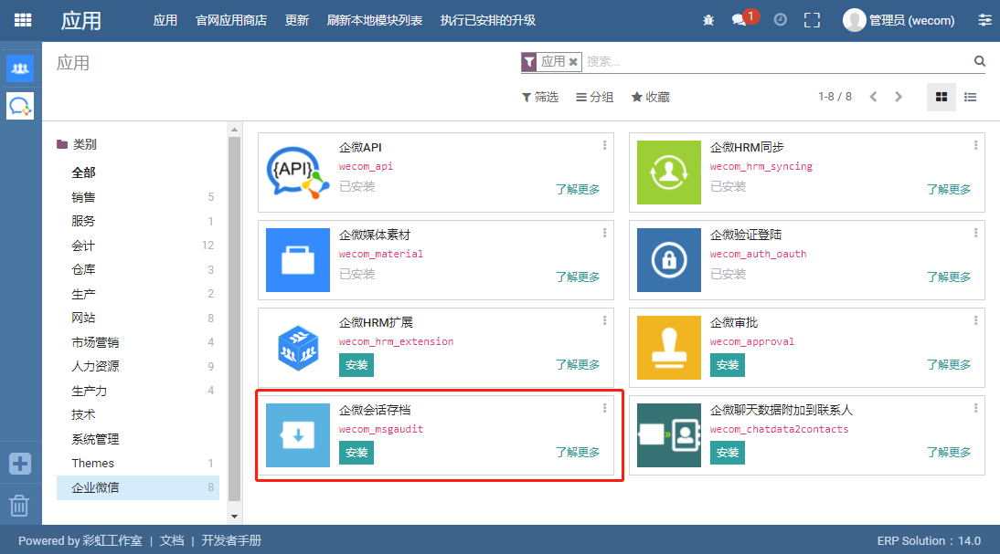

会话存档
=================================

.. toctree::
   :maxdepth: 2

安装 
---------------------------------

1. 在“应用”中安装

-----------------

2. 在“企微设置”中安装

.. image:: img/install2.png

-----------------

部署SKD服务
---------------------------------

参照 “部署SDK服务” 章节

参数设置 
---------------------------------

-----------------

生成消息加密密钥
---------------------------------

-----------------

企微设置 
---------------------------------

1. 登陆企业微信后台，“管理工具” → “会话内容存档”，设置下图标识的位置

-----------------

2. 设置公钥，如下图：

-----------------

拉取记录 
---------------------------------

请确保SDK服务已经启动

-----------------

更新群聊信息 
---------------------------------

使用API接口，更新群聊信息。请问频繁点击此按钮，否则会引发“系统繁忙”的错误

格式化消息
---------------------------------

目前只处理了 “文本消息”、“图片消息”、“链接消息” 这个三个类型的聊天记录

-----------------

-----------------

-----------------
