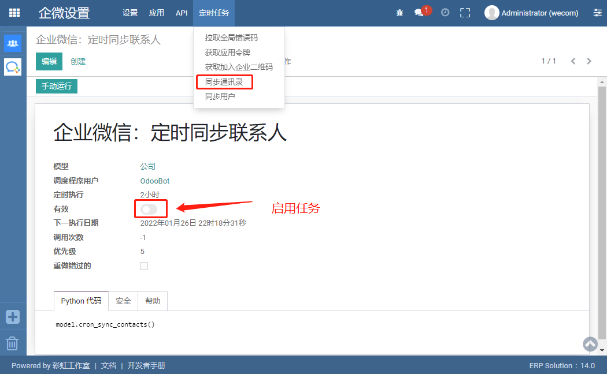

企微HRM同步 
=================================

.. toctree::
   :maxdepth: 2

安装
---------------------------------

1. 安装应用，如下图:

   .. image:: img/hrm_syncing.png

绑定应用
---------------------------------

1. 绑定通讯簿同步应用，如下图：
   
   .. image:: img/setting.png

通讯录参数
---------------------------------

1. 生成通讯录应用配置参数和刷新加入企微的二维码，如下图：
   
   .. image:: img/parameters.png

通讯录事件
---------------------------------

使用通讯录事件，在企业微信端发生“成员”、“部门”、“标签”变更时，企业微信通过事件推送通知给Odoo，Odoo可以获取到变更后的通讯录数据。

1. 设置通讯录事件：如下图：

   .. image:: img/event.png

2. 在企业微信后台设置“通讯录同步”的“接收事件服务器”，如下：

   - 打开“通讯录同步”，点击“接收事件服务器”，
   .. image:: img/work_setting1.png
   
   - 设置“接收事件服务器”，复制URL: https://你的域名/wecom_callback/2/contacts，将域名粘贴到URL：
   .. image:: img/work_setting2.png

   - 将上一步骤复制过来的“Token”和“EncodingAESKey” 粘贴到下图位置：
   .. image:: img/ event_setting.png

同步通讯录任务
---------------------------------

同步用户任务
---------------------------------

